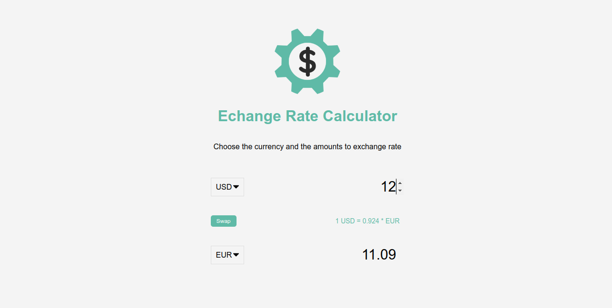

# Currency Converter

This is a simple currency converter application built using vanilla JavaScript. The application allows users to input any currency amount and convert it to a target currency using real-time exchange rates.

## Features

- Convert between different currencies using real-time exchange rates.
- User-friendly interface for entering amounts and selecting currencies.
- Responsive design for optimal viewing on different devices.

## Demo

[Live Demo](https://exchange-rate-calculator-bdg6xrg1d-ajraneweragmailcoms-projects.vercel.app/)

## Screenshots



## Getting Started

### Prerequisites

- Web browser (Chrome, Firefox, Safari, etc.)
- Internet connection (for fetching exchange rates)

### Installation

1. Clone the repository:

   ```sh
   git clone  https://github.com/moslemajra85/currency-converter.git
   ```

2. Navigate to the project directory:

   ```sh
   cd currency-converter
   ```

3. Open `index.html` in your web browser.

### Usage

1. Open the application in your web browser.
2. Enter the amount you wish to convert.
3. Select the source currency from the dropdown menu.
4. Select the target currency from the dropdown menu.
5. Click the "Convert" button to see the converted amount.

## Built With

- HTML
- CSS
- JavaScript
- [Exchange Rates API](https://exchangeratesapi.io/) for real-time exchange rates
